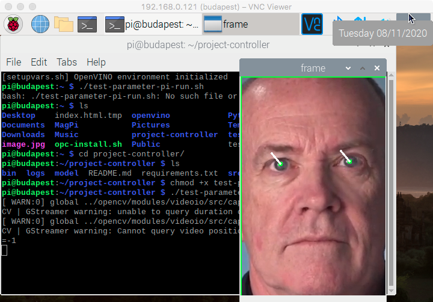

# Computer Pointer Controller

This project controls the mouse using the gaze by creating a computer vision pipeline. The pipeline detects the face and gives the head pose and the eye locations. The model uses this information to estimate the next position. The project uses the [Intel Neural Compute Stick 2](https://ark.intel.com/content/www/us/en/ark/products/140109/intel-neural-compute-stick-2.html) device as an AI edge device.

## Project Installation

1. Model Download
```
./downloader.py --name face-detection-adas-binary-0001 --precisions=INT8,FP16,FP32,FP32-INT1 -o ~/project-controller/model/
./downloader.py --name head-pose-estimation-adas-0001 --precisions=INT8,FP16,FP32 -o ~/project-controller/model/
./downloader.py --name landmarks-regression-retail-0009 --precisions=INT8,FP16,FP32 -o ~/project-controller/model/
./downloader.py --name gaze-estimation-adas-0002 --precisions=INT8,FP16,FP32 -o ~/project-controller/model/
```
2. Move to the project folder
```
cd ~/project_controller
```
3. Virtual Environment
```
virtualenv --python=/usr/bin/python3 gaze_app
gaze_app/bin/activate
```
VirtualBox uses only the virtual environment. For an IoT device like a Raspberry Pi, it is not useful. In the praxis IoT device as only one purpose. Please check, only /runtimes/virtualbox-ubuntu-project-controller.tar.xz.

4. Install requirements
```
pip install -r requirements.txt
```
5. Run Project
```
python3 src/main.py
python3 src/main.py --help
```
Running the main.py without parameters; it uses the default settings from config_util.py and config_util_pi.py.

## Demo Run

```
python3 src/main.py
    --input_file=bin/demo.mp4 \
    --input_type=video \
    --device=MYRIAD \
    --fd=/home/pi/project-controller/model/intel/face-detection-adas-0001/FP32/face-detection-adas-0001.xml \
    --lr=/home/pi/project-controller/model/intel/landmarks-regression-retail-0009/FP32/landmarks-regression-retail-0009.xml \
    --hp=/home/pi/project-controller/model/intel/head-pose-estimation-adas-0001/FP32/head-pose-estimation-adas-0001.xml \
    --ge=/home/pi/project-controller/model/intel/gaze-estimation-adas-0002/FP32/gaze-estimation-adas-0002.xml
```

| Parameter        | Device                                                       |
| :--------------- | :----------------------------------------------------------- |
| **--input_file** | Path to the input file or input stream.                      |
| **--input_type** | Input type for the stream (cam=camera, video=video file).    |
| **--device**     | This parameter describes the computing device for edge processing (CPU, GPU, MYRIAD, FPGA). |
| **--fd**         | The path to the face detection model.                        |
| **--lr**         | The path to the facial landmarks detector model.             |
| **--hp**         | The path to the head pose estimator model.                   |
| **--ge**         | The path to the gaze estimator model.                        |



## Project Structure
```
runtimes
├─ Archives of the runtimes
│  ├── virtualbox-ubuntu-project-controller.tar.xz
│  └── raspi-project-controller.tar.xz
pointer-controller
├── README.md
├── bin
│   └── demo.mp4
├── model
|   └── intel
│       ├── face-detection-adas-binary-0001
│       │   └── FP32-INT1
│       │       ├── face-detection-adas-binary-0001.bin
│       │       └── face-detection-adas-binary-0001.xml
│       ├── gaze-estimation-adas-0002
│       │   ├── FP16
│       │   │   ├── gaze-estimation-adas-0002.bin
│       │   │   └── gaze-estimation-adas-0002.xml
│       │   ├── FP16-INT8
│       │   │   ├── gaze-estimation-adas-0002.bin
│       │   │   └── gaze-estimation-adas-0002.xml
│       │   └── FP32
│       │       ├── gaze-estimation-adas-0002.bin
│       │       └── gaze-estimation-adas-0002.xml
│       ├── head-pose-estimation-adas-0001
│       │   ├── FP16
│       │   │   ├── head-pose-estimation-adas-0001.bin
│       │   │   └── head-pose-estimation-adas-0001.xml
│       │   ├── FP16-INT8
│       │   │   ├── head-pose-estimation-adas-0001.bin
│       │   │   └── head-pose-estimation-adas-0001.xml
│       │   └── FP32
│       │       ├── head-pose-estimation-adas-0001.bin
│       │       └── head-pose-estimation-adas-0001.xml
│       └── landmarks-regression-retail-0009
│           ├── FP16
│           │   ├── landmarks-regression-retail-0009.bin
│           │   └── landmarks-regression-retail-0009.xml
│           ├── FP16-INT8
│           │   ├── landmarks-regression-retail-0009.bin
│           │   └── landmarks-regression-retail-0009.xml
│           └── FP32
│               ├── landmarks-regression-retail-0009.bin
│               └── landmarks-regression-retail-0009.xml
├── requirements.txt
├── bin --> Input Data / Video
├── logs --> Log File  
└── src
    ├── face_detection.py
    ├── facial_landmarks_detection.py
    ├── gaze_estimation.py
    ├── head_pose_estimation.py
    ├── input_feeder.py
    ├── main.py
    ├── model.py
    ├── image_helper.py
    ├── config_util.py
    ├── config_util_pi.py
    └── mouse_controller.py
```

## Documentation
The following classes are implemented to start the required functionality:
* FaceDetector
* FacialLandmarksDetector
* GazeEstimator
* HeadPoseEstimator
* InputFeeder
* MouseController 

### FaceDetector
The face detector model detects the faces in an image and draws bounding boxes around the faces.
### FacialLandmarksDetector
The facial landmarks detector detects the left eye, right eye, nose, left mouth corner, right mouth corner in a face image.  It draws the landmarks on the face in the output image.
### GazeEstimator
The gaze estimator takes a face crop image, and the head poses in JSON format. The class writes the gaze direction in the output image.
### HeadPoseEstimator
The head pose estimator detects the pose of the head given a cropped face image. It writes an
axis to the head image on the output image.
### BaseModel
Basemodel is the basic model which implements the necessary functionality for Detector and Estimator classes.
### image_helper
Image_helper is a collection of helper functions for imaging processing.
### config_util, config_util_pi
Those classes are the basic configuration for the use environment. Config_util for Ubuntu VirtualBox and config_util_pi for Raspberry PI.
### InputFeeder
This class is used to feed the input from a stream. A stream can be an image, webcam, or video.
Start the program
### MouseController
Functionality to control the mouse on the display.

## Runtime Results

Unfourtantly on MacOS, some library issues make it hard to challenge the test on the iMac. The base of the test is an iMac (CPU 3,4 GHz Intel Core 7, Mid 2011). The CPU runs on a Virtualbox Ubuntu 18.0.04_4 with 4 GByte RAM and two CPU kernels, Python 3.6. 

The second test phase runs on a Raspberry Pi 4 with 4 GByte RAM and Intel Neural Compute Stick 2, Python 3.7.3.

All times are, given in seconds.

### Ubuntu Virtualbox

Both instances use OpenVino 2020.4_287. It seems that many API changes between the 2019 versions. For operations in praxis, there can be a lot of incomplete and time-consuming issues.

#### FP32 Benchmark

The FP32 test run needs 743,5828 seconds to complete. It takes 59 pipeline actions. The operation time of the pipeline is between approximately 0.0410 and 0.0577 seconds.

Model     | Device | Precision | Loadtime (sec)|  Inference (sec)
:---------|:------:|:---------:|--------:|----------:
Detection | CPU    | FP32-INT1 |  0.1426 |  0.0371
Landmarks | CPU    | FP32      |  0.0695 |  0.0017
Head Pose | CPU    | FP32      |  0.0702 |  0.0046
Gaze      | CPU    | FP32      |  0.0877 |  0.0044

#### FP16 Benchmark

The FP16 test run needs 716,9815 seconds to complete. It takes 59 pipeline actions. The operation time of the pipeline is between approximately 0.0517 and 0.0824 seconds.

Model     | Device | Precision | Loadtime (sec) | Inference (sec)
:---------|:------:|:---------:|--------:|----------:
Detection | CPU    | FP32-INT2 | 0.1689 | 0.0522
Landmarks | CPU    | FP16      | 0.0881 | 0.0049 
Head Pose | CPU    | FP16      | 0.0974 | 0.0086  
Gaze      | CPU    | FP16      | 0.1177 | 0.0039  

### Raspberry Pi 4
#### FP32 Benchmark

The FP32 test run needs 872,9310 seconds to complete. It takes 59 pipeline actions. The operation time of the pipeline is between approximately 0.145 and 0.175 seconds.

Model     | Device | Precision | Loadtime (sec)|  Inference (sec)
:---------|:------:|:---------:|--------:|----------:
Detection | NC2    | FP32      | 5.0589 |  0.0966
Landmarks | NC2    | FP32      | 5.2418 |  0.0031
Head Pose | NC2    | FP32      | 5.3571 |  0.0047
Gaze      | NC2    | FP32      | 5.3797 |  0.0053

#### FP16 Benchmark

The FP16 test run needs 874,6798 seconds to complete. It takes 59 pipeline actions. The operation time of the pipeline is between approximately 0.144 and 0.193 seconds.

Model     | Device | Precision | Loadtime (sec) | Inference (sec)
:---------|:------:|:---------:|--------:|----------:
Detection | NC2    | FP16      |  5.0163 | 0.0945
Landmarks | NC2    | FP16      |  5.2367 | 0.0033 
Head Pose | NC2    | FP16      |  5.2921 | 0.0056 
Gaze      | NC2    | FP16      |  5.3078 | 0.0058  


## Results
Using a lower model precision is to trade-off accuracy for inference time. This test did not measure a big-time difference. Maybe with other and lager models, there can measure a more significant time difference.

Both test runs show that there is no significant difference between the FP16 and FP32 models. The higher loading time for the first model to the NC2 has to evaluate. It maybe is a result that the NC2 is a separate device on the Raspberry PI and needs for the first load more time. In this test, NC2 is near to the CPU but not better. Maybe for future test runs, the NC2 has to run on the Virtualbox.